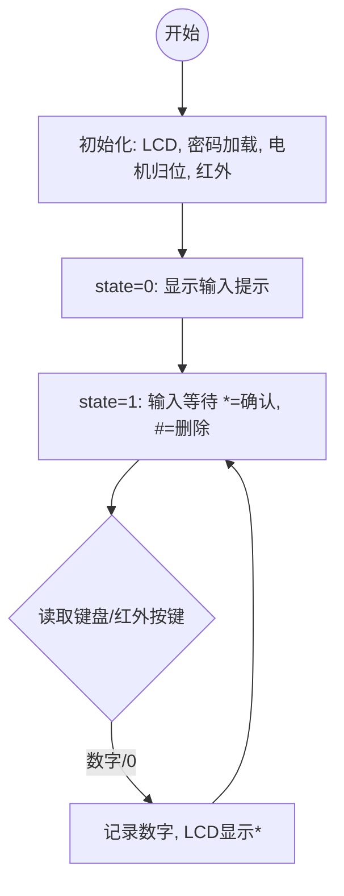

```mermaid
graph TD
    %% 状态机主流程
    START((开始)) --> INIT[初始化: LCD, 密码加载, 电机归位, 红外];
    INIT --> S0[state=0: 显示输入提示];

    %% 状态 1: 密码输入与验证
    S0 --> S1[state=1: 输入等待 *=确认, #=删除];
    
    S1 --> INPUT{读取键盘/红外按键};
    
    INPUT -- 数字/0 --> DIGIT[记录数字, LCD显示*];
    DIGIT --> S1;

    
```