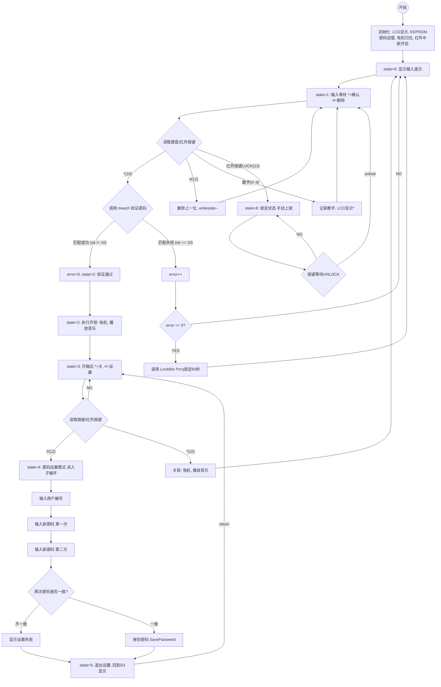

```mermaid
graph TD
    %% 状态机主流程
    START((开始)) --> INIT[初始化: LCD显示, EEPROM密码加载, 电机归位, 红外中断开启];
    INIT --> S0[state=0: 显示输入提示];

    %% 状态 1: 密码输入与验证 (主流程)
    S0 --> S1[state=1: 输入等待 *=确认, #=删除];
    
    S1 --> INPUT{读取键盘/红外按键};
    
    %% 验证分支
    INPUT -- *(10) --> VERIFY{调用 meach 验证密码};


    INPUT -- #(12) --> DELETE[删除上一位, writestate--];
    DELETE --> S1;

    

    %% 处理输入分支
    INPUT -- 数字(0~9) --> DIGIT[记录数字, LCD显示*];
    DIGIT --> S1;

    

    

    
    VERIFY -- 匹配成功 (ok != 10) --> S2_SUCCESS[error=0, state=2: 验证通过];
    
    %% 失败和错误处理 (分支到右侧)
    VERIFY -- 匹配失败 (ok == 10) --> ERROR_COUNT[error++];
    
    ERROR_COUNT --> CHECK_ERRORS{error == 5?};
    
    CHECK_ERRORS -- NO --> S0;

    CHECK_ERRORS -- YES --> LOCK_60s[调用 Lock60s f'm'q锁定60秒];
    LOCK_60s --> S0;

    %% 状态 2, 3, 5: 开锁后的操作 (主流程)
    S2_SUCCESS --> S2_OPEN[state=2: 执行开锁: 电机, 播放音乐];
    S2_OPEN --> S3[state=3: 开箱后 *=关, #=设置];

    S3 --> POST_KEY{读取按键/红外按键};
    
    POST_KEY -- NO --> S3;
    
    POST_KEY -- #(12) --> S4[state=4: 密码设置模式 进入子循环];

    POST_KEY -- *(10) --> S3_CLOSE[关锁: 电机, 播放音乐];
    S3_CLOSE --> S0;
    
    

    %% 状态 4: 密码设置 (子流程)
    S4 --> S4_USER[输入用户编号];
    S4_USER --> S4_PASS1[输入新密码 第一次];
    S4_PASS1 --> S4_PASS2[输入新密码 第二次];

    S4_PASS2 --> S4_CHECK{两次密码是否一致?};
    
    S4_CHECK -- 不一致 --> S4_FAIL[显示设置失败];
    S4_FAIL --> S5[state=5: 退出设置, 回到S3显示];

    S4_CHECK -- 一致 --> S4_SAVE[保存密码 SavePassword];
    S4_SAVE --> S5;
    
    S5 -- return --> S3; 
    
    %% 手动锁定 (分支到右侧)
    INPUT -- 红外按键LOCK(13) --> S8;

    %% 状态 8: 锁定状态 (独立循环)
    S8[state=8: 锁定状态 手动上锁] --> S8_WAIT{按键等待UNLOCK};
    
    S8_WAIT -- NO --> S8;
    S8_WAIT -- unlock --> S1;
```