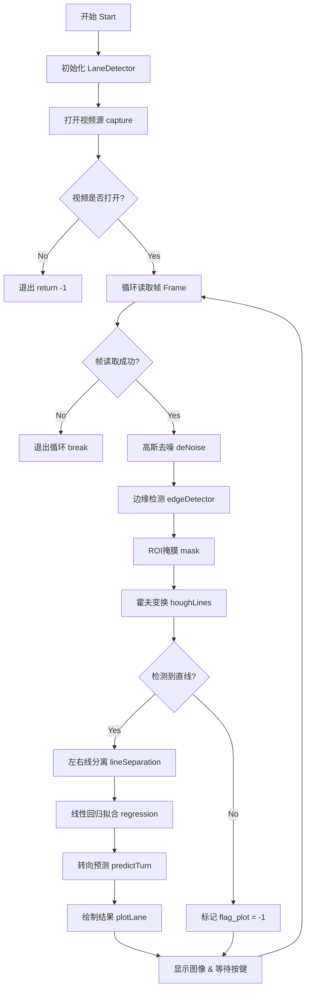

```mermaid
graph TD
    A[开始 Start] --> B[初始化 LaneDetector]
    B --> C[打开视频源 capture]
    C --> D{视频是否打开?}
    D -- No --> E[退出 return -1]
    D -- Yes --> F[循环读取帧 Frame]
    F --> G{帧读取成功?}
    G -- No --> H[退出循环 break]
    G -- Yes --> I[高斯去噪 deNoise]
    I --> J[边缘检测 edgeDetector]
    J --> K[ROI掩膜 mask]
    K --> L[霍夫变换 houghLines]
    L --> M{检测到直线?}
    M -- Yes --> N[左右线分离 lineSeparation]
    N --> O[线性回归拟合 regression]
    O --> P[转向预测 predictTurn]
    P --> Q[绘制结果 plotLane]
    M -- No --> R[标记 flag_plot = -1]
    Q --> S[显示图像 & 等待按键]
    R --> S
    S --> F
```